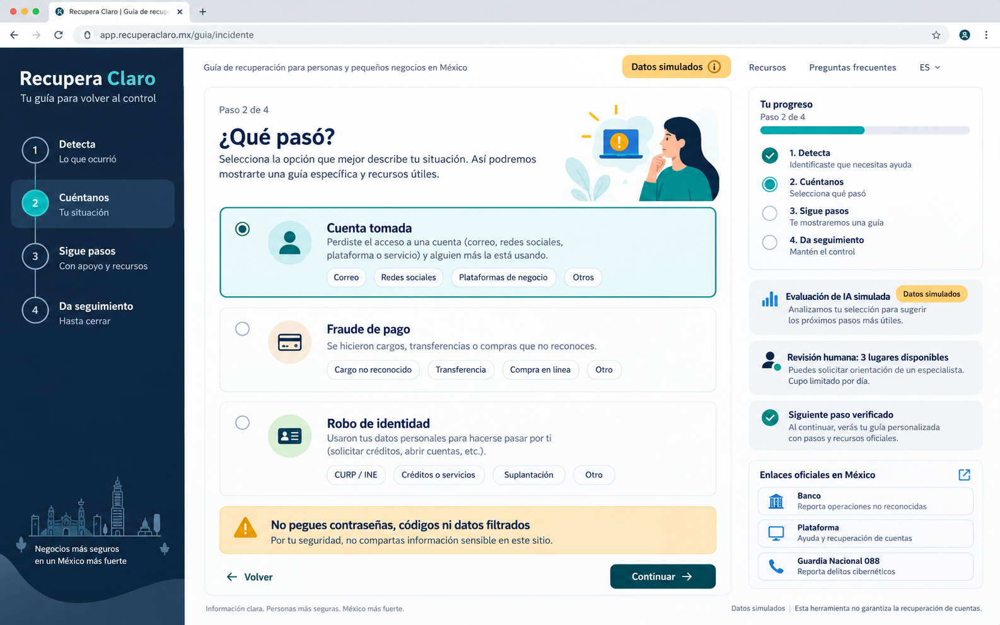
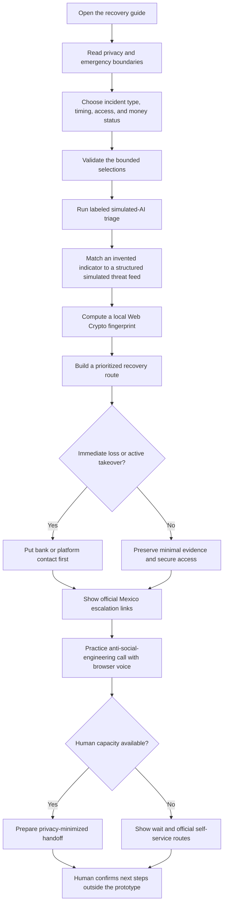
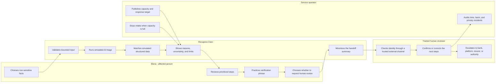

# Recupera Claro - Week 8 build packet

## Problem in my words

After an account takeover, identity theft, or payment fraud, a person is under time pressure and surrounded by generic advice. Mexico has official reporting channels, banks have dispute processes, and platforms have recovery tools, but the victim still has to decide what to do first, which evidence is safe to preserve, and when a human must take over. Recupera Claro turns a small set of non-sensitive choices into a prioritized recovery route without pretending that software can verify the victim, reverse a transfer, erase leaked data, or declare the person safe.

## Exact user

Elena is an invented 46-year-old administrator at a 12-person food distributor in Mexico. A work messaging account was taken over and a supplier-payment message may have been falsified. She uses WhatsApp daily, reads carefully when stressed, and needs an ordered response she can explain to her bank and employer. She must never be asked to paste a password, one-time code, private key, leaked record, bank account number, or real identity document.

The first contracted-payer hypothesis is the breached SME: its owner or finance lead releases a case budget when an account takeover, identity misuse, or payment incident affects operations. The prototype tests a price of **MXN 2,500 per human-reviewed case** after a free pilot; the affected person pays nothing. This is a hypothesis, not evidence of demand. If no SME signs a pilot or the service cannot deliver a verified first response within 30 minutes at the proposed price, the business model stops or pivots.

## Success definition

Before the module closes, Elena can select what happened without entering sensitive text, receive a clearly labeled simulated-AI triage result, inspect why each step is prioritized, verify official escalation routes, practice one anti-social-engineering call with browser voice, and prepare a privacy-minimized human handoff. The app must show uncertainty, remaining reviewer capacity, and a stop state; it must never promise account recovery, transfer reversal, data deletion, or personal safety.

## Image-generated mockup

This image was generated before implementation as the design target. The working product may simplify the composition to improve mobile accessibility and make uncertainty and privacy boundaries more explicit.

## Feature flow

## Actor swimlane

## Benchmark

Best existing solution on Earth: [IdentityTheft.gov's recovery plan](https://www.identitytheft.gov/Steps) is the strongest benchmark because it converts a victim's situation into ordered recovery actions, an identity-theft report, and a trackable plan rather than leaving the victim with a static awareness article.

Mine differs or localizes by: Recupera Claro uses Mexico-specific official routes, a shadow-clause intake that never accepts raw leaked data or credentials, visible human-review capacity, a local simulated indicator check, and a browser-voice exercise for resisting social-engineering pressure.

Official escalation content is grounded in the [Guardia Nacional 088 reporting channel](https://www.gob.mx/guardianacional/acciones-y-programas/denuncia-por-internet-ante-la-guardia-nacional) and its [account-recovery guidance](https://www.gob.mx/gncertmx/documentos/instructivo-de-ciberseguridad). Any bank or platform action remains a link to that provider's official channel; the prototype never submits a report or represents an institution.

## Long view - light charter

If this slice works, in three years Recupera Claro becomes a trusted recovery layer that Mexican SMEs, insurers, and managed service providers can offer immediately after a digital incident. It coordinates privacy-minimized triage, verified human guidance, official institution handoffs, and measurable recovery outcomes without becoming a vault of leaked identities or an automated judge of safety. Its enduring advantage is not a magical model but a reliable operating system for helping people act under stress while keeping humans accountable for consequential advice.

## Scope cut

This week I am **not** building:

- an antivirus, password manager, credential vault, breach-search engine, or identity-verification service;
- a real LLM call, because the free public deployment has no server-side secret; the on-screen model output is deterministic and labeled **simulated AI**;
- automatic account recovery, bank contact, transfer reversal, data deletion, police reporting, or legal advice;
- uploads, raw incident narratives, leaked datasets, passwords, codes, private keys, identity documents, bank details, or personal-data storage;
- an authenticated production case system or a real human-review operation;
- a guarantee that an official channel, bank, platform, or authority will recover losses;
- a verified payer, price, legal duty, fine amount, or economic return;
- a verdict that the victim, account, device, or business is safe.

## Architecture and Dragon Stack

| Layer | Choice | Role and boundary |
|---|---|---|
| Interface | React + TypeScript + Vite | Accessible single-page flow with bounded, validated controls |
| LLM layer | Deterministic simulated-AI triage | Demonstrates classification, reasons, uncertainty, and refusal states without a key or false claim |
| Security tooling/API | Browser Web Crypto API | Computes a local SHA-256 fingerprint for an invented indicator; sends nothing and stores no raw indicator |
| Structured breach data | Invented, versioned threat-pattern feed | Provides reproducible scenario matches; visibly labeled simulated |
| Voice | Browser Speech Synthesis API | Reads an anti-social-engineering rehearsal; no microphone access or recording |
| Decision logic | Pure TypeScript functions | Keeps priority rules, capacity stop, minimization, and validation auditable |
| Persistence | Session-only state; no database | Avoids personal-data storage; authentication and RLS are not applicable |
| Hosting | Vercel static deployment | Free public URL with security headers and no runtime secret |
| Documentation | Markdown, Mermaid, generated PDFs | Preserves packet-before-code, tests, persona findings, decisions, and submission evidence |

## Blueprint conditions translated into product rules

1. **Payer gate:** Name the breached SME owner/finance lead, incident trigger, proposed MXN 2,500 price, 30-minute response target, and kill condition. Do not imply a contract exists.
2. **Identity and action:** The prototype does not verify identity. A trained person must verify through a trusted external channel before giving case-specific advice. Software only prepares next steps and official escalation paths.
3. **Shadow clause:** No raw leaked datasets, passwords, codes, private keys, identity documents, bank details, or open incident narrative. Minimize the handoff to categorical facts and show uncertainty instead of a safe verdict.
4. **Capacity and choice:** Display a simulated daily capacity of three human reviews, a 30-minute target, an operator owner, and a hard stop when capacity is zero. No repeated or coercive notification.
5. **Evidence gate:** Compare completion time and verified steps against a static official-link directory. Track privacy incidents, harmful advice, user confusion, and cost. Stop if there is no payer or trustworthy operation.

## Security floor decisions

1. The app requires no secret or API key. No `.env` value is committed.
2. It stores no personal data. Authentication is therefore not applicable to this prototype.
3. It has no database or user table, so Row Level Security is not applicable.
4. Every control is an enum or bounded choice. The app has no free-text or upload field and rejects invalid state before triage.
5. All people, incidents, reviewer capacity, threat indicators, and outputs are invented and labeled simulated.
6. Vercel headers set a restrictive Content Security Policy, `X-Content-Type-Options`, `Referrer-Policy`, and `Permissions-Policy`; voice output is local and microphone access is disabled.

## Test plan

### Mechanical pass

1. A user cannot begin triage until incident type, timing, access, and money status are selected.
2. Invalid or unknown enum values are rejected by the pure validation function.
3. Every result says **Evaluación de IA simulada** and exposes the input categories, reasoning, uncertainty, and limits.
4. Payment loss within 24 hours prioritizes contacting the official bank channel; an active account takeover prioritizes the platform's official recovery flow.
5. The app never accepts or displays passwords, codes, private keys, raw leaked data, account numbers, identity documents, or real names.
6. The structured threat feed, incident examples, dates, and fingerprints are labeled simulated.
7. Web Crypto hashing occurs locally and the raw indicator is not persisted.
8. Speech synthesis works only after a user action, requests no microphone, and has an equivalent visible script.
9. Human-review capacity shows owner, target, remaining simulated slots, and a clear stop state at zero.
10. The minimized handoff contains only categorical facts and warns that identity is still unverified.
11. Official links open the institution's own domain; no report is sent by the prototype.
12. The interface works by keyboard and remains readable at 390px and 1440px.
13. Production headers deny camera, microphone, geolocation, payment, and framing.
14. Source and built output contain no plausible secret or real personal seed data.

### Persona pass

Use a fresh synthetic-user session as **Elena**, the invented 46-year-old administrator described above. She is responsible for supplier payments, uses WhatsApp daily, distrusts unfamiliar forms, and is afraid that a wrong click will make the loss worse. Walk her through screenshots in order, ask her to narrate where she hesitates or would quit, log every confusion, and fix the single most consequential problem before the final deployment.

## Acceptance boundary

The slice succeeds when a stressed user can reach a plausible, official next step quickly and understand why it is first. It does not prove identity, validate a real incident, guarantee recovery, establish the payer hypothesis, or substitute for a bank, platform, insurer, trained responder, lawyer, or authority.
